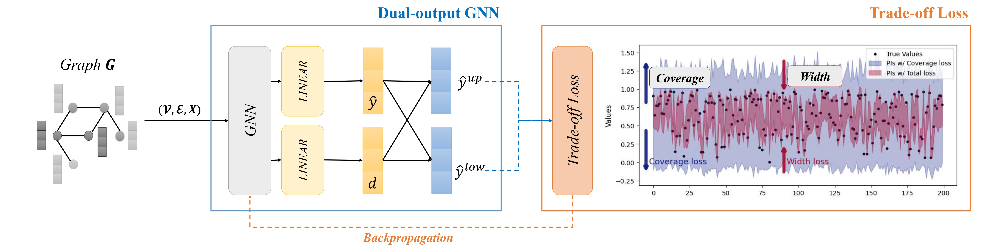

# Quantile-free Prediction Interval GNN
paper : QpiGNN: Quantile-Free Uncertainty Quantification in Graph Neural Networks

repo : https://anonymous.4open.science/r/QpiGNN-11614



## Requirements & Setup
This codebase utilizes Anaconda for managing environmental dependencies. Please follow these steps to set up the environment:

1. **Download Anaconda:** [Click here](https://www.anaconda.com/download) to download Anaconda.

2. **Clone the Repository:**
Clone the repository using the following command.
   ```bash
   git clone https://anonymous.4open.science/r/QpiGNN-11614
   ```

3. **Install Requirements:**
   - Navigate to the cloned repository:
     ```bash
     cd QpiGNN
     ```
   - Create a Conda environment from the provided `env.yaml` file:
     ```bash
     conda env create -f env.yaml
     ```
   - Activate the Conda environment:
     ```bash
     conda activate qpi-gnn
     ```

This will set up the environment required to run the codebase.

## Datasets
Below are the details and download links for real-world datasets used in our experiments:

### U.S. County-Level Datasets (Education, Election, Income, Unemployment)
This dataset are constructed from county-level U.S. maps, using adjacency information derived from geographic boundaries. Node attributes include socioeconomic indicators, and targets `reflect either vote shares or demographic statistics. The base topology and election outcomes were obtained from an open [(GitHub)](https://github.com/tonmcg/), while additional attributes were sourced from the U.S. Department of Agriculture Economic Research Service. [(Download)](https://www.ers.usda.gov/data-products/county-level-data-sets/)

### Wikipedia & Twitch Graphs (Chameleon, Squirrel, Crocodile, PTBR)
This dataset were collected from the MUSAE project, which provides temporal and social graphs annotated with node features and continuous targets. These datasets are widely used for benchmarking node regression in non-homophilous graphs. [(Download)](https://github.com/benedekrozemberczki/MUSAE)

### Transportation Networks (Anaheim, Chicago) 
This Networks model urban road networks as graphs, with nodes corresponding to intersections and edges to road segments. Node features include traffic-related metrics, and the targets correspond to flow estimates or congestion levels. These datasets were obtained from the Transportation Networks for 
[(Research repository)](https://github.com/bstabler/TransportationNetworks)

These datasets provide valuable resources for our experiments.

## Training QpiGNN
Please refer to the training/training_code.txt file.

```python
python train.py --dataset <dataset name> --model <model name> --target_coverage 0.9 --lambda_factor 0.5

```

## Thanks to
We extend our gratitude to the authors of the following libraries for generously sharing their source code and dataset:
[MUSAE](https://github.com/benedekrozemberczki/MUSAE),
[SQR](https://github.com/facebookresearch/SingleModelUncertainty),
[RQR](https://github.com/TPouplin/RQR/tree/main),
[CF-GNN](https://github.com/snap-stanford/conformalized-gnn)

Your contributions are greatly appreciated.

## Citation
```

```